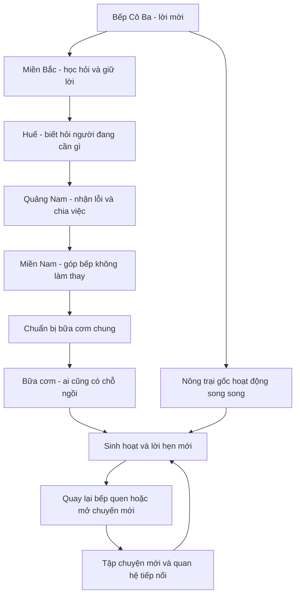

# Kế hoạch cốt truyện — Bếp chung, đường về

## 1. Phạm vi và quyết định

- Chỉ khảo sát, thiết kế nội dung và lập kế hoạch; không sửa mã game.
- Hướng người dùng đã chọn: hành trình qua Bắc–Trung–Nam; người chơi là nhân vật riêng; giữ Cô Ba và Dì Năm; chấp nhận đề xuất cơ chế mới để kể chuyện đầy đủ.
- Tên làm việc: **Bếp chung, đường về**. Câu chủ đề nội bộ: **Khác giọng, chung một mâm**. Không bắt nhân vật đọc câu chủ đề.
- Yêu cầu đã xác nhận: **cốt truyện mở, không có kết thúc tổng thể**. Không có trạng thái hoàn thành toàn bộ truyện, màn kết hay hậu truyện.
- Đề xuất chưa duyệt: mở đầu ngắn tại bếp Cô Ba miền Nam, chuyến đầu đi Bắc → Trung → Nam rồi trở về tổ chức một bữa chung. Đây là cung truyện đầu để xây quan hệ, không phải toàn bộ hành trình. Những chuyến sau có thể quay lại nơi cũ hoặc mở địa điểm mới.
- Tất cả nhân vật chính đều trưởng thành; Bé Hai là tên gọi ở nhà của một phụ nữ 25 tuổi.
- Đề xuất hai bản lời thoại: nguyên bản có tục mạnh và bản nhẹ cùng nội dung, cùng phần thưởng. Không coi công tắc này là hệ thống xác minh tuổi hay một phân loại độ tuổi chính thức.
- Bản này là khung truyện và kịch bản đại diện để duyệt, chưa phải toàn bộ lời thoại sản xuất.

## 2. Kết quả khảo sát dự án

### 2.1. Những gì đã có

| Hạng mục | Bằng chứng | Ý nghĩa đối với cốt truyện |
|---|---|---|
| Công cụ chọn món và game nông trại trong cùng sản phẩm | [Giới thiệu dự án](../README.md:1) | Truyện là lớp tùy chọn, không chặn nhu cầu chọn món |
| Gieo, tưới, thu hoạch, nấu, câu cá, giao nông sản | [Xử lý hành động game](../src/domain/reducer.ts:265) | Dùng làm hành động kể chuyện, không tạo một game khác ngay từ đầu |
| Khu bếp, kho, chợ, bản đồ, nhiệm vụ, bạn vườn mở thành bảng trong game | [Màn hành trình](../src/features/food-reel/journey/JourneyScene.tsx:131) | Có điểm đặt nhật ký, đơn truyện và đối thoại |
| Cảnh nông trại đang dùng canvas nhiều lớp | [Tải cảnh thực tế](../src/features/food-reel/journey/FarmGame.tsx:80), [Cảnh nông trại](../src/features/farm-anim/FarmScene.tsx:38) | Không mặc định các bản dựng 3D/PlayCanvas khác là cảnh chính đang chạy |
| Miền Nam mở sẵn; miền Trung cần 2 dấu, miền Bắc cần 4 dấu | [Dữ liệu vùng](../src/data/game.ts:595) | Quyền dùng công thức hiện tại phải tách khỏi quyền đến địa điểm trong truyện |
| Có công thức mở đầu cả ba miền | [Công thức game](../src/data/game.ts) | Có thể dạy nấu món miền Bắc sớm mà không phá khóa vùng |
| Cô Ba có đơn nông sản theo ngày | [Đơn hàng hiện tại](../src/domain/orders.ts:13) | Giữ sinh hoạt hằng ngày; không dùng đơn ngẫu nhiên làm điều kiện bắt buộc của tuyến truyện |
| Tưới là tăng tốc, không tưới cây vẫn lớn | [Quy tắc tưới](../src/data/game.ts:657) | Không viết cảnh cây chết do người chơi bỏ game |
| Nấu dùng nguyên liệu và ghi số lần nấu; không thấy cơ chế cháy nồi | [Xử lý nấu](../src/domain/reducer.ts:437) | Sự cố bếp chỉ là cảnh hư cấu được báo trước, không giả báo mất tài nguyên |
| Lưu khách trên máy, tài khoản lưu bản tiến trình | [Lưu tiến trình](../src/domain/persistence.ts:15), [Lưu trên máy chủ](../server/lib/Account.php:182) | Truyện chơi được không đăng nhập |
| Đồng bộ hiện dựa nhiều vào độ dài sổ thưởng và XP | [Đối chiếu tiến trình](../src/domain/sync.ts:31) | Chỉ đọc thoại cũng tạo tiến trình, nên không thể giữ nguyên tiêu chí này |
| Nội dung món ăn và giao diện có lớp ngôn ngữ | [Quy trình ngôn ngữ](../README.md:48) | Tách lời thoại truyện khỏi mô tả món ăn |

### 2.2. Giới hạn của khảo sát

- Đã đọc mã và tài liệu; chưa chạy game trong trình duyệt, chưa chạy bộ kiểm thử. Không kết luận trải nghiệm thực tế đã được kiểm chứng.
- Dự án thay đổi song song trong lúc khảo sát. [Dữ liệu game](../src/data/game.ts) mới có thêm rau, cây trái, nấm, vật nuôi, ong và thuyền; phần tiến trình cũng đang được sửa.
- Khi thấy định nghĩa ong/thuyền, chưa thấy kết quả tìm kiếm xử lý tương ứng trong tầng luật game ở thời điểm kiểm tra. Do đó chưa đưa chúng vào đường bắt buộc.
- Các số dòng là vị trí lúc khảo sát, có thể dịch chuyển sau cập nhật.
- Trước triển khai phải chụp lại danh mục cơ chế thực sự hoàn thiện và đọc lại các tệp đang sửa. Không ghi đè công việc song song.

## 3. Nguyên tắc sáng tác

1. Yêu Tổ quốc bắt đầu từ biết quý người làm ra bữa ăn, giữ lời, biết giúp người ở nơi mình đi qua.
2. Đồng bào không phải người chờ nhóm chính tới cứu. Mỗi nơi có người chủ động, có kỹ năng và được quyền từ chối đề nghị.
3. Không có miền nào được đặt cao hơn miền khác; không lấy giọng nói, nghèo khó hay thiên tai làm trò cười.
4. Khẩu vị là sở thích của từng nhà. Không khẳng định người Bắc đều ăn nhạt, người Trung đều ăn cay hoặc người Nam đều ăn ngọt.
5. Món ăn có biến thể và lịch sử giao thoa. Nếu chưa kiểm chứng nguồn gốc, nói đây là cách nhà nhân vật nấu, không tuyên bố nguồn gốc độc quyền.
6. Tục vì cảm xúc và quan hệ, không tục vì chỉ tiêu. Không bắt mọi nhân vật nói cùng một từ.
7. Khi đối diện mất mát thật hoặc người đang khổ, ngừng pha trò; không lấy tiếng chửi làm cao trào cảm động.
8. Bỏ một ngày chơi không làm ai đói, cây chết hay câu chuyện thất bại.
9. Không ép người chơi đăng nhập, đăng ảnh, ăn món ngoài đời hoặc mời bạn để hoàn thành tuyến chính.
10. Không biến yêu nước thành điểm số, bài kiểm tra lòng trung thành hay ép quyên góp.

## 4. Tiền đề và động lực chuyến đi

Cô Ba đang vận hành một quán nhỏ và khu vườn cung cấp rau. Dì Năm từng cùng những người quen ở nhiều nơi tổ chức các bữa cơm cho người đi làm xa, người lỡ chuyến và hàng xóm. Các bếp ấy chưa hề là một tổ chức lớn; chỉ là những người từng giúp nhau rồi lâu ngày mất liên lạc.

Dì muốn mở lại **bữa cơm chung định kỳ**, nhưng không muốn dựng một mâm mang tên ba miền mà không hỏi người ở đó. Cô Ba nhờ nhóm đi gặp lại vài người quen, học cách họ tổ chức bếp và xin phép ghi công thức vào sổ. Người chơi đang phụ vườn và muốn tìm lại niềm vui làm việc có ích, nhận phần lo vật tư và nhật ký chuyến đi.

Chuyến đầu có mục tiêu cụ thể: đem lời mời tới các bếp quen, làm thử một bữa tại mỗi nơi, học cách mua đủ–nấu vừa–chia công bằng, rồi trở về mở bữa đầu tiên. Sau đó, các bếp tiếp tục liên lạc, người quen nhờ việc hoặc rủ nhóm trở lại; nông trại và quán tạo thêm những câu chuyện đời thường. Không săn bảo vật, không cần bí mật gia đình hoặc người chết để tạo động lực. Bữa chung là điểm hẹn lặp lại với những tình huống mới, không phải đích cuối.

Xung đột chính là rất đời: nóng miệng, vội ghi công thức, ngại nhận giúp đỡ, sợ bị xem thường, chưa thống nhất ai gánh việc. Mỗi chương giải quyết một phần bằng hành động, không bằng một bài diễn văn.

### Logic nông trại khi đi xa

- Nông trại gốc vẫn do Cô Ba, Dì Năm và người ở nhà chăm; giao diện vườn là nơi người chơi quản lý nguồn lực chung từ xa.
- Thu hoạch ở vườn không có nghĩa rau tươi được dịch chuyển tức thì tới Hà Nội hoặc Huế.
- Đơn địa phương dùng một giỏ nguyên liệu riêng của chặng. Mỗi giỏ ghi rõ mua tại chợ, người quen góp hoặc nhóm thu tại điểm địa phương.
- Truyện không dùng đồng hồ chuyến xe thật hay bắt chờ nhiều ngày. Chọn khởi hành là chuyển cảnh; thời gian kể chuyện tách khỏi thời gian cây lớn.

## 5. Dàn nhân vật và quan hệ

| Nhân vật | Hồ sơ đề xuất | Vai trò và đường phát triển | Giọng và giới hạn |
|---|---|---|---|
| Người chơi | Người trưởng thành; tên tự chọn tùy chọn; không bắt chọn giới tính hay quê | Lo vật tư, chọn cách giúp, ghi sổ; từ người đứng ngoài thành người được tin giao việc | Có lựa chọn đáp trung tính, cà khịa hoặc lắng nghe; không bị ép nói tục |
| Cò | 27 tuổi, Hà Nội; từng làm việc bàn giấy, hay chống chế khi không biết | Dẫn chặng Bắc, học xin giúp thay vì giả biết hết; trong cung đầu chủ động rửa nồi và gọi về nhà, các cung sau tiếp tục quan hệ gia đình | Đéo, vãi, địt mẹ xuất hiện khi giật mình hoặc giữa bạn thân; không chửi thẳng người lớn |
| Tẹt | 28 tuổi, Huế; làm bếp, thích làm cho xong hơn giải thích | Dẫn chặng Huế; học nói rõ nhu cầu và giao việc, không âm thầm chịu hết | Ít câu, mô/răng/rứa theo ngữ cảnh; tức mới nói im mẹ đi; tránh pha phương ngữ tùy tiện |
| Tèo | 26 tuổi, Quảng Nam; sửa đồ và lo vận chuyển | Dẫn chặng Quảng Nam; từ hứa nhanh sang nhận lỗi, kiểm tra trước khi giao | Nóng miệng, xưng tau/mi khi hợp quan hệ; cần người địa phương đọc duyệt |
| Bé Hai | 25 tuổi, Sài Gòn, gia đình miền Tây; quen mua bán | Lo chi phí, chợ và ghi lời người nấu; học hỏi trước khi tự làm thay người khác | Má, đụ má, xàm, cha nội; không chọc vào xuất thân hay nỗi đau |
| Cô Ba | 46 tuổi, chủ quán hiện có | Giữ hệ thống bếp, công thức và đơn hằng ngày; thực tế, minh bạch chi phí | Nói rõ việc, cà khịa nhẹ, hiếm khi tục nặng |
| Dì Năm | 58 tuổi, miền Tây; người khởi xướng bữa cơm chung | Chăm người nhưng cũng có quyền nghỉ; trong bữa chung đầu chịu ngồi xuống ăn, về sau tập giao việc và có sở thích riêng | Quỷ sứ, cha nội, mẹ bà lúc bực; không thành máy phát tục |

### 5.1. Mạng lưới nhân vật địa phương mở rộng

Các hồ sơ dưới đây là đề xuất sáng tác, không phải mô tả đại diện tính cách cả vùng. Tuổi đều là tuổi trưởng thành. Quê quán, nơi sống và giọng nói không nhất thiết trùng nhau; nhân vật có đời sống ngoài việc phục vụ nhóm chính.

| Nhân vật | Địa phương và nghề | Tính cách, nhu cầu riêng | Quan hệ và mạch truyện tiếp nối |
|---|---|---|---|
| Bác Hạnh, 56 | Hà Nội; bán đồ ăn sáng, lo bữa trưa cho người làm chợ | Thẳng, nhớ số lượng rất kỹ; muốn bớt ca sáng để có thời gian riêng | Quen Dì Năm từ những lần phụ bếp; biết Cò hồi nhỏ. Cung đầu hỏi nhu cầu và xử lý hành mua dư; về sau vào Nam chơi, để nhóm tập làm chủ nhà |
| Mận, 29 | Hải Phòng; nhận đặt hải sản và phụ quán gia đình | Nhanh miệng, ghét bị mặc định lúc nào cũng rảnh; muốn có ngày nghỉ thật | Bạn cũ của Cò, quen Bé Hai qua chuyện đặt hàng. Có tuyến chốt số lượng, đổi người nhận hàng và cuộc hẹn không bàn công việc |
| Anh Lâm, 35 | Nam Định; làm bếp tại Hà Nội | Cẩn thận, thích thử món nhưng khó chịu khi bị yêu cầu làm đúng một kiểu duy nhất | Làm việc cùng bác Hạnh, không phải người chỉ xuất hiện để giới thiệu phở. Có chuyện chọn thực đơn, ghi nguồn công thức và về thăm nhà |
| Chị Thảo, 32 | Phú Thọ; phụ trách vườn rau của gia đình | Điềm tĩnh nhưng có giới hạn; muốn khách hỏi trước khi hái và chụp ảnh | Điểm vườn ngoại thành được đổi thành chuyến ghé vườn có địa điểm cụ thể khi nội dung được duyệt. Dạy nhóm phân loại rau, rồi cần nhóm phụ đón một buổi gặp người mua |
| Anh Hải, 34 | Nghệ An; chạy xe hàng, hiện sống ở Sài Gòn | Hay đùa, báo việc rõ; muốn giữ lời với gia đình mà không nhận thêm chuyến vô hạn | Quen Cô Ba qua giao hàng, là cầu nối Bắc Trung Bộ–miền Nam. Tèo học cách báo trễ từ Hải; có tập Hải về quê và nhóm thay một phần việc đã thỏa thuận |
| Chị Oanh, 38 | Huế; nhận may, điều phối bữa ăn cho nhóm sửa bếp trong xóm | Nhẹ giọng nhưng quyết đoán; không muốn người khác tự sắp lại đồ nhà mình | Người chủ động trong chặng Huế, từng làm bếp cùng Tẹt. Về sau rủ nhóm tới một bữa thường ngày, không gắn mọi lần xuất hiện với mưa lũ |
| Bin, 24 | Đà Nẵng; sửa xe đạp và đồ điện nhỏ | Hài khô, không thích bị nhờ sửa miễn phí mãi; đang tính mở chỗ làm riêng | Bạn nghề của Tèo. Có tuyến mượn dụng cụ, trả đúng hẹn và thống nhất công sửa; không mặc định mở thêm hệ thống hỏng đồ trong game |
| Chú Phước, 52 | Quảng Nam; làm mộc, phụ bếp gia đình | Ít lời, coi trọng kiểm đồ trước giao; cũng có lúc nhận quá nhiều việc | Chủ bếp nhận bữa mì Quảng, không chỉ làm người lớn dạy Tèo. Có tập chú phải nhờ nhóm giúp và tự thừa nhận mình cũng tính thiếu |
| Vy, 28 | Quy Nhơn, Bình Định; phụ quán bún cá và ghi sổ hàng | Nói rõ, thích biển nhưng không thích bị biến thành hướng dẫn viên; muốn học một món từ bếp khác | Kết bạn với Bé Hai rồi trao đổi cách ghi sổ với bác Hạnh. Có chuyến Vy ghé Huế hoặc Sài Gòn, đổi vai từ người đón sang người được đón |
| Hương, 31 | Đắk Lắk; làm vườn cùng gia đình, bán nông sản theo đơn | Kiên nhẫn với cây, không kiên nhẫn với người nhận hàng quên báo; muốn có lịch giao vừa sức | Quen chị Thảo qua nhóm trao đổi việc trồng. Tạo nhánh Tây Nguyên sau nghiên cứu riêng, không dùng cà phê để đại diện toàn bộ vùng hay tự gán dân tộc từ địa danh |
| Chú Sáu Lộc, 55 | Sài Gòn; sửa đồ gia dụng gần quán Cô Ba | Cà khịa, thích sửa đồ dùng được tiếp; muốn có buổi chiều nghỉ chơi cờ | Bạn lâu năm của Cô Ba; Tèo vừa hợp vừa cãi với chú về cách sửa. Có chuyện kiểm kê đồ bếp và nhóm học trả công thay vì coi tình nghĩa là miễn phí |
| Chị Liên, 36 | Quê Thanh Hóa, sống tại Sài Gòn; làm theo ca, góp bữa trong khu trọ | Thực tế, không thích được kể như người khổ; muốn đổi ca để tham gia bữa chung | Quen Cô Ba và Bé Hai. Nối chuyện xa quê với đời sống hiện tại; giúp nhóm hiểu không phải ai cũng rảnh đúng giờ ăn do nhóm chọn |
| Út Sen, 27 | Cần Thơ; bán rau, phụ vườn nhà | Vui, hay nói quá khi thân nhưng nghiêm khi chốt đơn; muốn tách việc của mình khỏi việc nhà giao thêm | Bạn thân Bé Hai, gọi Dì Năm là dì theo quan hệ quen biết chứ chưa mặc định họ hàng. Có tuyến chợ, phần rau dư và việc từ chối một đơn quá sức |
| Chú Bảy Được, 57 | An Giang; phụ trách ghe hàng của gia đình | Chậm nói, thích kiểm dây buộc; đang tập giao việc cho người khác | Quen Dì Năm, đối chiếu với Tèo về giữ lời và chia việc. Ghe trong truyện là bối cảnh, không mặc định đồng nhất với thuyền khai thác của game |
| Nhi, 26 | Sóc Trăng; làm bánh tại bếp gia đình | Tỉ mỉ, dễ bực khi người khác ghi công thức chưa hỏi; muốn thử bán một mẻ nhỏ theo cách riêng | Bạn Út Sen, quen Tẹt qua bếp chung. Có tập thử bánh, xin phép ghi công thức và chọn giữ riêng một phần bí quyết. Chưa gán căn tính dân tộc hoặc tôn giáo; nếu phát triển phải nghiên cứu và đọc duyệt riêng |

### 5.2. Cách đưa nhân vật vào truyện mà không làm loãng nhóm chính

- **Cung đầu xuất hiện trực tiếp:** bác Hạnh, anh Lâm, chị Oanh, chú Phước, chị Liên và Út Sen. Chị Oanh thay vai chủ bếp chưa đặt tên tại Huế; chú Phước làm rõ chủ bếp Quảng Nam; Út Sen là người quen dẫn vào chợ miền Nam; chị Liên là một người cùng bàn việc chia phần, không mặc định người nhận cứu trợ.
- **Giới thiệu qua liên hệ ngắn rồi phát triển sau:** Mận, anh Hải, Bin và chú Sáu Lộc. Chỉ cho họ xuất hiện khi có việc liên quan; không nhét tất cả vào cảnh mở đầu.
- **Các cung mở rộng:** chị Thảo, Vy, Hương, chú Bảy Được và Nhi. Chỉ mở địa điểm/nhiệm vụ khi đã viết và kiểm duyệt nội dung; không coi danh sách này là cam kết đã có bản đồ playable.
- Mỗi tập ưu tiên 2–4 người có vai trò chủ động. Người địa phương không phải tất cả đều gia nhập đội đi xuyên Việt; họ có việc, người thân và quyền từ chối đi.
- Trước khi viết tập cho một nhân vật phải chốt: điều họ muốn, điều họ không nhận làm, người họ đã quen, quyết định họ tự đưa ra và thay đổi còn được nhớ ở lần gặp sau.
- Không dùng một mẫu giọng cho cả miền: bác Hạnh thẳng và ít tục; Mận nhanh miệng giữa bạn thân; anh Lâm nói kỹ khi làm bếp; chị Oanh mềm nhưng rõ giới hạn; Bin hài khô; Út Sen cà khịa rồi chốt việc. Từ địa phương phải được đọc diễn, không trang trí mọi câu.
- Nhân vật có thể yêu quê và thương người mà vẫn cãi, mệt, cần tiền công hoặc muốn ở một mình. Không chia thành nhóm người tốt giúp miễn phí và nhóm người xấu vì từ chối.

### 5.3. Các tuyến nối vùng thay vì ba cụm nhân vật tách biệt

| Tuyến | Người liên quan | Chuyện cụ thể và khả năng tiếp nối |
|---|---|---|
| Bác Hạnh vào Nam | Bác Hạnh, Cò, Cô Ba, chị Liên | Chọn lịch gặp phù hợp ca làm, hỏi bác muốn đi đâu; nhóm không tự quyết một lịch tham quan kín mít |
| Chuyến hàng có giới hạn | Mận, anh Hải, Bé Hai, Tèo | Chốt người nhận và khối lượng; một người từ chối nhận thêm. Giải quyết bằng đổi kế hoạch, không ca ngợi làm quá sức |
| Tẹt và Nhi thử món | Tẹt, Nhi, Út Sen, anh Lâm | Mỗi người đưa một cách làm, xin phép ghi lại; bất đồng về thay đổi công thức mà không thi món miền nào thắng |
| Đồ bếp đi một vòng | Bin, Tèo, chú Sáu Lộc, chú Phước | Mượn, sửa, trả và ghi công người làm; có cuộc gặp tiếp khi món đồ được dùng ở bữa khác |
| Rau không tự chạy tới bếp | Chị Thảo, Hương, Cô Ba, Bé Hai | Trao đổi kỹ năng và đặt hàng theo khả năng; nguồn giỏ từng địa phương rõ ràng, không dịch chuyển sản vật miễn phí |
| Đi chơi cũng là một cuộc hẹn | Vy, Cò, Út Sen, Dì Năm | Gặp nhau không kèm nghĩa vụ tổ chức bữa cộng đồng. Có khoảng nghỉ và chuyện riêng để tình bạn không chỉ tồn tại qua nhiệm vụ |

### 5.4. Thoại mẫu khi nhân vật mới bước vào mạng lưới

Các cảnh dưới đây theo chuẩn thoại mới ở mục 9. Chỉ dẫn hành động dùng tiết chế, giúp diễn đạt điều nhân vật không nói ra; không phải thao tác gameplay bắt buộc.

**Mận:** Hai, mấy giờ lấy? Tao hỏi lần thứ ba rồi đấy.

**Bé Hai:** Đang gọi Hải. Chờ tao chút.

**Mận:** Chờ từ trưa tới giờ. Đéo lấy thì nói, tao còn về.

**Anh Hải — qua điện thoại:** Anh tới đầu ngõ rồi. Có ai ra chỉ anh cái nhà không?

**Mận:** Đứng đấy. Đừng lái vào, ngõ bé lắm.

*Mận lấy thêm một chai nước lạnh, đặt lên thùng hàng.*

**Mận:** Hai, bảo ông ấy uống đi. Nắng thế này.

---

**Chị Oanh:** Ấy, đừng kê đó. Chị còn ngồi may.

**Cò:** Ơ, em tưởng chị bảo sát tường.

**Chị Oanh:** Tường bên kia. Đây, để chị—

**Tẹt:** Chị để đó. Cò, giữ đầu ni.

**Cò:** Rồi. Tèo, nhấc lên. Nhấc chứ đừng kéo, xước sàn người ta.

**Tèo:** Biết rồi. Tay mi vướng dưới chân bàn kìa.

*Cò rút tay. Tẹt chèn lại chiếc chân bàn hơi kênh, không nói thêm.*

---

**Út Sen:** Hai. Hai chục bó này ở đâu ra?

**Bé Hai:** Tao nhận thêm. Tưởng còn rau.

**Út Sen:** Rau còn. Ai cắt? Tao có hai tay thôi má.

**Bé Hai:** Để tao gọi lại.

**Út Sen:** Gọi liền đi. Đừng có dạ dạ rồi ôm hết vô nữa.

*Hai quay ra gọi. Sen ngồi buộc nốt bó rau, đẩy đôi dép về phía bạn.*

**Út Sen:** Mang vô. Nãy mới thấy miểng chai ngoài đó.

### Quan hệ cần giữ nhất quán

- Cò và Tèo hay tranh ai biết việc; Tẹt ngắt bằng một yêu cầu thực tế.
- Bé Hai cà khịa Cò nhưng chủ động chừa món ít cay khi đã biết khẩu vị của Cò, không vì Cò là người Bắc.
- Tèo và Tẹt cùng miền Trung nhưng có cách nói, cách nấu và tính khí riêng.
- Cô Ba quản lý quán; Dì Năm lo bữa chung. Không cho hai người cùng giao một nhiệm vụ rồi gọi lẫn tên.
- Người chơi có năng lực riêng, không phải chân sai vặt hay cái máy chọn đáp án tốt.
- Nhân vật phụ tại mỗi chặng có ít nhất một kỹ năng, một nhu cầu và một quyết định của riêng mình.

## 6. Cấu trúc truyện mở và cung đầu tiên

Quy mô nội dung khởi đầu đề xuất: mở đầu, 6 chặng thuộc cung đầu, 24 nút nhiệm vụ và 6 tuyến phụ ngắn. Đây là lượng nội dung biên soạn ban đầu, không phải giới hạn cuộc sống của nhóm. Mỗi nút có cảnh trước, việc làm rõ ràng, phản hồi sau, thay đổi được ghi vào nhật ký.

### Kiến trúc kể chuyện lâu dài

- **Mạch dài:** quán, nông trại, mạng lưới bếp quen và quan hệ của nhóm tiếp tục phát triển; không có nhiệm vụ cuối giải quyết tất cả.
- **Cung truyện:** một chuyến đi hoặc một việc lớn có thể được giải quyết tại chỗ. Khép lại việc này không kết thúc câu chuyện chung và không bắt mọi người hoàn thiện tính cách.
- **Tập chuyện:** những việc cụ thể như mua đồ, sửa quai, đón người quen, thử món, chia ca hoặc bất đồng trong nhóm. Có mục tiêu hữu hạn để người chơi thấy mình làm được việc.
- **Sinh hoạt:** lời chào, trò chuyện và phản hồi theo những gì đã xảy ra; không thay tuyến truyện được viết tay bằng đơn ngẫu nhiên lặp vô hạn.
- Lần đầu đi Bắc → Trung → Nam tạo các mối quen. Sau đó mở quyền quay lại tự chọn trong phạm vi nội dung đã phát hành; không bắt chạy lại cùng vòng ba miền.
- Nhân vật nhớ việc đã học: Cò có thể chủ động hỏi số lượng, Tèo báo trục trặc sớm hơn, Bé Hai xin phép trước khi ghi tên. Xung đột mới đến từ hoàn cảnh mới, không reset họ thành người chưa từng trưởng thành.
- Không dùng chia tay vĩnh viễn, trang sổ cuối, màn tổng kết toàn truyện hoặc tỷ lệ hoàn thành toàn bộ. Nhật ký chỉ báo tiến độ từng cung và tập đang có.

### Mở đầu — Đi đâu thì ăn đã

Người chơi tới phụ Cô Ba, cùng nhóm thu luống rau thơm đã sẵn trong game. Dì Năm nhận tin nhắn từ một người quen ngoài Bắc hỏi thăm bếp cũ. Cả nhóm bàn chuyện đi, nói chuyện tiền xe và ai trông vườn trước khi nói chuyện lớn.

Kết quả: người chơi hiểu ai là ai, được giao sổ và bảng vật tư, tự chọn tham gia. Có nút để lại chuyến đi cho lần sau.

### Chương 1 — Ngoài này cũng có người chờ

Địa điểm: Hà Nội và một điểm vườn ngoại thành, không giả làm mô phỏng toàn miền Bắc. Nhóm gặp bác Hạnh, người quen của Dì Năm, đang lo bữa trưa cho vài người làm ở chợ. Cò ngại thừa nhận lâu rồi chưa về, cố tỏ ra biết mọi thứ rồi mua sai số lượng.

Cao trào: Cò chịu hỏi lại và mang phần mua dư sang bếp bên cạnh theo thỏa thuận. Người chơi học bún riêu từ cách nấu của bác Hạnh; phở và bún chả là nhánh phụ, không khóa tuyến chính vì chanh/tỏi cấp cao.

Kết: Cò gọi về nhà, không phải vì nhóm giảng đạo; việc đã có người nhận giúp nên Cò mới dám dành một buổi cho gia đình.

### Chương 2 — Đừng đoán người ta cần gì

Địa điểm: một xóm tại Huế. Tẹt gặp lại người quen đang sửa bếp và sắp lại đồ sau đợt mưa trước đó. Không có cảnh thảm họa diễn ra để đẩy người chơi vào áp lực cứu hộ.

Xung đột: nhóm mang kế hoạch sẵn; người ở đây cần người chuyển đồ và nấu bữa cho đội sửa bếp hơn là quà nhóm định tặng. Tẹt vừa xấu hổ vừa cáu vì không nói rõ từ đầu.

Cao trào: hỏi lại nhu cầu, phân việc, nấu một nồi bún bò với ớt để riêng. Nhóm làm dưới sự điều phối của người địa phương.

Kết: người nhận giúp góp lại công thức và kỹ năng bảo quản đồ khô. Quan hệ hai chiều, không đóng khung miền Trung chỉ có thiên tai.

### Chương 3 — Nói được thì làm được

Địa điểm: Quảng Nam, chợ và một bếp gia đình. Tèo hứa đưa bữa trưa tới nhóm thợ nhưng xe chở đồ gặp trục trặc trong cảnh truyện. Không làm hỏng thuyền hay xe của game vì người chơi vắng mặt.

Xung đột: Tèo giấu việc vì sợ bị nói vô dụng, làm cả nhóm chờ. Người chơi có thể chọn nhận phần gọi báo, chia giỏ hoặc phụ kiểm đồ; các lựa chọn đều giải quyết được việc.

Cao trào: Tèo xin lỗi cụ thể, đổi cách vận chuyển, cùng người địa phương hoàn thành bữa mì Quảng. Bài học không phải làm anh hùng, mà là báo sớm để người khác cùng xử lý.

Kết: Tèo ghi tên từng người đã góp vào sổ, không nhận công thay.

### Chương 4 — Góp một tay, đừng giành hết

Địa điểm: Sài Gòn rồi bếp ven sông tại miền Tây. Bé Hai dẫn nhóm gặp người bán và người nấu quen. Dì Năm tham gia trực tiếp ở chặng này, Cô Ba vẫn lo quán gốc.

Xung đột: Bé Hai mua và chia quá nhanh, tưởng mình tiện tay là giúp, nhưng làm lệch phần người khác đã tính. Một người góp đồ không muốn nêu tên hoặc chụp ảnh; nhóm tôn trọng.

Cao trào: kiểm lại danh sách, chia phần theo nhu cầu do bếp địa phương xác nhận, nấu canh chua; bánh xèo là lựa chọn thêm. Không khẳng định mọi gia đình miền Nam dùng cùng một vị ngọt.

Kết: chốt cách công khai chi phí nhưng giữ riêng thông tin cá nhân, gửi lời mời về bữa chung.

### Chương 5 — Không ai gánh cả cái bếp

Trở về bếp Cô Ba. Sổ có nhiều món, nhưng tiền, chỗ ngồi và sức người có hạn. Cô Ba chỉ ra nếu ôm hết sẽ không giữ được bữa định kỳ. Dì Năm quen làm quá sức và lảng tránh khi được bảo nghỉ.

Cao trào: chọn thực đơn vừa khả năng, chừa một phần không cay, có lựa chọn ăn chay, chia việc. Người chơi chốt danh sách và thấy các nhân vật tự nhận phần trách nhiệm.

Kết: không dùng ngày Quốc khánh như điều kiện bắt buộc. Có thể thêm sự kiện lịch theo mùa sau khi duyệt văn hóa và nội dung.

### Chương 6 — Dì ngồi xuống ăn đi

Bữa đầu không hoàn hảo: thiếu một cái ghế, một món hơi lệch vị, có người đến muộn. Mỗi người dùng điều đã học để xử lý mà không đổ lỗi.

Cao trào tình cảm: Dì Năm định đứng ăn trong bếp; cả nhóm dọn một chỗ thật sự cho dì. Cô Ba không tuyên bố thành công bằng điểm số, chỉ ghi bữa sau ai trực.

Mốc chuyển tiếp: người chơi ghi thêm một trang sổ; mọi người tiếp tục nấu món nhà mình chứ không trộn thành một món tượng trưng. Yêu đất nước nằm ở tên người, địa điểm, món ăn và lời hứa được giữ. Bác Hạnh gửi lời hẹn, Tẹt nhắc chuyện ở Huế hoặc Cô Ba có việc mới tại quán. Không chạy màn kết, không tuyên bố nhóm đã hoàn thành sứ mệnh.

### Mạch tiếp nối — Bếp vẫn mở

- Nông trại, đơn hằng ngày, sưu tập món và truyện cùng tồn tại từ đầu; không gọi sinh hoạt này là hậu truyện.
- Người chơi quay lại địa điểm đã quen để gặp chuyện mới, không chỉ xem lại cảnh cũ. Đọc lại cảnh cũ được ghi rõ là hồi tưởng và không nhận thưởng lại.
- Mỗi bữa chung có người tham dự, việc cần lo và diễn biến khác nhau. Không biến bữa nào cũng thành màn cảm động mời Dì Năm ngồi xuống.
- Các cung tiếp theo đề xuất: **Bác Hạnh vào Nam** — nhóm đổi vai từ khách sang chủ nhà; **Quán đông, người ít** — Cô Ba và nhóm thống nhất giới hạn công việc; **Tẹt muốn thử món mới** — bất đồng về thay đổi cách nấu mà vẫn tôn trọng người chỉ món; **Một chuyến về không có việc lớn** — Cò về thăm nhà, nhóm học ở cạnh nhau mà không cần luôn làm dự án giúp người.
- Lời hẹn chỉ được thể hiện thành nhiệm vụ nhận được khi tập tương ứng đã có nội dung. Không hứa một chuyến đang chơi được nếu chưa sản xuất.
- Khi đã đọc hết các tập đang phát hành, vẫn có sinh hoạt và phản hồi phù hợp lịch sử; nhật ký nói **Chưa có lời hẹn mới**, không nói đã phá đảo. Không giả có thoại vô hạn và không bắt cày đơn lặp để mở nội dung chưa tồn tại.
- Tập mới được bổ sung bằng nội dung biên soạn có mã ổn định, điều kiện rõ và kiểm duyệt. Không đòi đăng nhập đúng ngày để giữ quyền đọc; người đến muộn vẫn tiếp cận được các tập truyện thường trực.

## 7. Bảng 24 nút của cung đầu

Ký hiệu: **Có** = dựa vào hành động đã thấy trong mã; **Mới** = cần bổ sung; **Lai** = hành động cũ nhưng cần bọc ngữ cảnh hoặc tách tài nguyên.

| Nút | Việc và điều kiện | Cơ chế | Kết quả kể chuyện |
|---|---|---|---|
| M0-1 | Mở hành trình, nghe lời chào; có thể bỏ qua | Mới | Nhận diện Cô Ba, Dì Năm và nhóm |
| M0-2 | Thu hoạch luống có sẵn; nếu người chơi cũ đã thu thì công nhận lịch sử đáng tin | Có + Lai | Cò trêu nhưng cùng mang rau vào |
| M0-3 | Nhận lời chuyến đi, xem ai trông vườn, lấy giỏ mở đầu | Mới | Đồng ý chuyến đi không đồng nghĩa đăng nhập |
| B1-1 | Đến điểm Hà Nội, hỏi bác Hạnh cần bao nhiêu phần | Mới | Xác nhận nhu cầu thay vì đoán |
| B1-2 | Chuẩn bị giỏ cho bún riêu; hiển thị nguồn từng nguyên liệu | Lai | Cò chịu hỏi lại sau mua nhầm |
| B1-3 | Nấu bún riêu trong bếp chặng; dùng giỏ riêng | Lai | Cò và người chơi cùng chia việc |
| B1-4 | Chọn giúp giao phần hoặc dọn bếp; kết thúc lời mời | Mới | Cò có người thay phần việc để về thăm nhà |
| T2-1 | Đến Huế, hỏi việc ưu tiên | Mới | Người địa phương quyết định việc cần giúp |
| T2-2 | Sắp ba kiện đồ theo bảng rõ ràng; không trò chơi tốc độ | Mới | Tẹt tập nhờ người khác |
| T2-3 | Chuẩn bị và nấu bún bò; ớt riêng theo người ăn | Lai | Không ép cả bàn cùng khẩu vị |
| T2-4 | Ghi cách cất đồ khô và lời mời do chủ bếp đồng ý | Mới | Người giúp cũng nhận lại kiến thức |
| Q3-1 | Đến Quảng Nam, nhận danh sách bữa trưa | Mới | Tèo hứa việc có phạm vi rõ |
| Q3-2 | Cảnh trục trặc; chọn gọi báo hoặc chia lại giỏ | Mới | Lựa chọn khác nhau nhưng không phạt lắng nghe |
| Q3-3 | Nấu mì Quảng bằng giỏ địa phương | Lai | Tèo nhận lỗi, nhóm sửa kế hoạch |
| Q3-4 | Giao bữa bằng bảng xác nhận và ghi tên người góp | Mới | Không nhận công thay người khác |
| N4-1 | Đến chợ miền Nam, hỏi phần góp và nhu cầu | Mới | Bé Hai dừng tự quyết |
| N4-2 | Chuẩn bị giỏ canh chua; cá có phương án mua đảm bảo | Lai | Không kẹt vì kết quả câu cá ngẫu nhiên |
| N4-3 | Nấu canh chua, xác nhận vị với chủ bếp | Lai | Tôn trọng biến thể gia đình |
| N4-4 | Chọn cách ghi nhận đóng góp, tôn trọng người không muốn nêu tên | Mới | Minh bạch không đồng nghĩa phơi thông tin |
| C5-1 | Trở về, đọc ba trang lời mời và kiểm nguồn lực | Mới | Công nhận chuyến đi và giới hạn thực tế |
| C5-2 | Chọn thực đơn có món ba miền và phương án không cay/ăn chay | Mới | Không buộc món gây dị ứng hoặc trái bộ lọc |
| C5-3 | Xác nhận phân công; mỗi nhân vật nhận một việc | Mới | Dì Năm được phép nghỉ |
| K6-1 | Chốt ba phần món bằng phần đã nấu/giỏ chuẩn bị được lưu | Mới | Không tiêu lại nguyên liệu đã dùng để hoàn thành nút |
| K6-2 | Cảnh bữa cơm, chọn cách xử lý ghế/phần đến muộn | Mới | Không ai bị bỏ ngoài mâm |
| K6-3 | Mời Dì Năm ngồi, ghi trang bữa đầu và nhận kỷ niệm | Mới | Ghi nhận mốc quan hệ, mở sinh hoạt tiếp nối và lời hẹn đã có nội dung |

### Luật nhiệm vụ và kinh tế

- Giỏ chặng chỉ dùng cho truyện, không bán, không đưa vào kho nông trại; tách rõ trên giao diện.
- Dùng công thức hiện có làm cấu trúc hành động, nhưng không gọi định lượng game là hướng dẫn nấu thật: cơm tấm hiện chỉ tính gạo và hành, không phải công thức đầy đủ ngoài đời.
- Mỗi nút có mã ổn định; giao vật tư phải kiểm tra và trừ một lần trong cùng giao dịch với ghi hoàn thành.
- Món đã nấu ở nút trước tạo dấu chuẩn bị, không yêu cầu người chơi nấu lại khi bữa chung kiểm tra.
- Mục tiêu cũ có thể công nhận thu hoạch/nấu từ dữ liệu bền vững; không suy diễn lời thoại đã đọc từ số XP.
- Hành động diễn ra trước khi nhận nút: chỉ công nhận các mốc tích lũy được chỉ định. Việc giao vật tư riêng phải làm sau khi nhận đơn.
- Không bắt quay trúng một món hay câu trúng cá để đi tiếp. Có đường mua/nhận giỏ chắc chắn.
- Không khóa bằng XP cấp cao; cây quý, ong, thuyền và vật nuôi mở rộng chỉ dành cho nhánh phụ sau khi cơ chế hoàn thiện.
- Thưởng chính: trang sổ, lời mời, ảnh kỷ niệm minh họa, thay đổi lời chào. Thưởng tài nguyên ít và cố định; cân đối sau khi kiểm tra kinh tế đang cập nhật.
- Phần thưởng hoàn thành chỉ cấp một lần; đọc lại, đổi bản nhẹ/nguyên bản không cấp thêm.

## 8. Tuyến phụ đề xuất

| Tuyến | Nội dung | Không được biến thành |
|---|---|---|
| Cò gọi về | Giúp Cò giao lại việc để gọi nhà, có lời thoại tiếp nối khi quay lại | Ép người chơi khai thông tin gia đình |
| Tẹt nhờ một tay | Tẹt hướng dẫn rồi để người khác làm một phần | Thi tài làm bếp theo vùng |
| Tèo sửa cái quai | Kiểm lại đồ trước giao, nhìn thấy cái quai được sửa trong ảnh | Cơ chế hỏng đồ gây mất mát khi vắng |
| Hai ghi tên người góp | Xin phép ghi tên, chọn để ẩn danh | Hệ thống mạng xã hội hoặc bắt đăng ảnh |
| Cô Ba tính nồi | Hiểu mua đủ, dùng phần dư và cân chi phí | Bài học tài chính dài chặn chơi |
| Dì Năm có phần | Chọn một món dì thích, đặt ghế, giao lại việc dọn | Biến dì thành người hy sinh vô hạn |

## 9. Quy tắc lời thoại

### 9.1. Chuẩn giọng mới — gắt ở miệng, thương ở việc

Chuẩn này thay cách viết thoại cũ trên toàn bộ cung, tuyến phụ và thoại sinh hoạt. Không chỉ sửa vài câu mẫu. Mục tiêu là nhóm người cụ thể đang sống cùng nhau, không phải một tuyển tập câu chửi hoặc một bài giảng về tình thương.

- **Viết cảnh trước, viết câu sau:** chốt ai đang bận gì, đang mệt hay lo điều gì, ai đã thân với ai. Tiếng gắt phải có nguyên nhân: nóng, chờ lâu, đồ nặng, hiểu nhầm, bạn hứa rồi quên. Không mở mọi cảnh bằng chửi để báo rằng nhân vật cá tính.
- **Lời nói không phải biên bản:** bỏ câu kiểu Tôi nhận trách nhiệm, Minh bạch không đồng nghĩa phơi thông tin, Việc tao nhận tao nói với người ta. Những ý đó ở ghi chú thiết kế; nhân vật nói Để tao gọi, Đừng ghi tên chị, hoặc đứng dậy làm việc.
- **Không nhận lỗi theo một khuôn:** có người nói Ừ, tao nhầm; có người hơi chống chế rồi tự sửa; lỗi lớn mới cần lời xin lỗi rõ. Không cho tất cả nói Tao sai rồi ngay sau một câu nhắc. Nếu làm tổn thương thật, không dùng đĩa cơm thay toàn bộ việc xin lỗi và sửa sai.
- **Cho phép câu cụt và lệch nhịp:** Ừ, đưa đây; Cái nào?; Không, bên kia. Có lúc nhân vật đáp vào điều đang lo thay vì trả lời đủ từng câu. Không cố viết lỗi chính tả, nói lắp hoặc nhồi dấu ba chấm để giả tự nhiên.
- **Chăm nhau bằng chi tiết đúng lúc:** kéo tay khỏi quai rách, để nước cạnh người đang bê đồ, chừa phần cơm, không gọi bạn khi bạn đang nghe máy mẹ. Không giải thích ngay rằng hành động ấy thể hiện lòng thương.
- **Không đóng cảnh bằng châm ngôn:** có thể dừng ở tiếng gọi lấy bát, một người ra ngoài gọi điện hoặc công việc còn dang dở. Không cần mọi cảnh có câu kết hay, tiếng cười hoặc sự hòa giải tức thì.
- **Tục có trọng lượng:** đéo là phủ định trong một số quan hệ; địt mẹ/đụ má dành cho lúc thật sự bật cảm xúc, không thay dấu phẩy. Cùng một người có thể văng tục với bạn và đổi sang dạ/vâng khi người lớn hỏi, không cần thông báo đổi giọng.
- **Gắt không đồng nghĩa độc ác:** cho phép bực, cằn nhằn và trêu dai trong giới hạn từng cặp. Khi người kia nói thôi hoặc im hẳn vì tổn thương, cảnh phải nhận ra ranh giới; không coi chịu nhục là bằng chứng thân thiết.
- **Giọng riêng không chỉ là phương ngữ:** Cò nói nhanh và hay chữa câu; Tẹt ít lời, tập trung việc trước mắt; Tèo dễ bật lại rồi đưa tay phụ; Bé Hai vừa nói vừa tính hoặc làm; Cô Ba hỏi ngắn, nhìn ra chỗ thiếu; Dì Năm có thể càm ràm, vui, mệt hoặc muốn nghỉ. Đây là hướng diễn, không phải công thức cho mọi câu.
- **Xưng hô theo từng cặp:** chốt bảng tuổi và quan hệ trước khi viết. Chị Oanh với nhóm là chị/em, bác Hạnh với Cò là bác/cháu. Không mặc định mọi người lạ xưng tôi/bạn; không cho Cô Ba và Dì Năm gọi nhau thiếu nhất quán. Phương ngữ được dùng theo người nói và hoàn cảnh, không gom mô/răng/rứa hoặc tau/mi vào mọi lượt.
- **Người chơi cũng nói như người đang có mặt:** lựa chọn ngắn như Đưa tôi đầu này / Tôi gọi cho / Chờ chút, đếm lại đã. Mục tiêu và hậu quả được giải thích ở giao diện, không ép người chơi phát biểu bài học.
- **Tình quê và tình người ở việc được nhớ:** lần quay lại hỏi chân bác đỡ chưa, nhớ chị Liên làm ca nào, dùng lại chiếc ghế chú Phước sửa. Không bắt ai phát biểu đại diện người Việt hoặc cả vùng.

### 9.1a. Mức độ, nhịp và kiểm duyệt

- Nguyên bản: cho phép đéo, địt mẹ, đụ má khi đúng nhân vật và quan hệ; không rải theo tỉ lệ bắt buộc.
- Bản nhẹ: thay bằng không, chết tiệt, trời đất hoặc viết lại cả câu; không chỉ phủ dấu sao khiến câu vẫn thô và khó đọc.
- Hướng đề xuất: giới thiệu trung tính, người chơi tự bật nguyên bản; lựa chọn này chưa được người dùng xác nhận riêng.
- Mỗi cảnh chính khoảng 6–12 lượt, cảnh cảm xúc có thể dài hơn nếu cần; mỗi lượt giữ 1–2 ý. Thoại sinh hoạt 1–3 lượt.
- Đùa tối đa vài nhịp rồi trở về việc; không cố mỗi câu một punchline.
- Với người lạ dùng tôi/bạn hoặc cách gọi phù hợp tuổi; quan hệ thân mới chuyển tao/mày, tau/mi. Không tăng mức tục chỉ theo số điểm thân thiết.
- Không chửi vào sắc tộc, vùng miền, giới, khuyết tật hoặc đời tư người chơi; không miệt thị người nhận giúp đỡ.
- Người chơi thất bại thao tác được hướng dẫn rõ, không bị nhân vật làm nhục.
- Tục không xuất hiện trong nút thao tác, lỗi hệ thống, email đăng nhập hoặc thông báo công khai ngoài game.
- Trước phát hành nhờ người Hà Nội, Huế, Quảng Nam và miền Tây/Sài Gòn đọc diễn; kiểm cả xưng hô lẫn ngữ cảnh, không chỉ từ địa phương.

### 9.2. Kịch bản đại diện đã viết lại

#### Trước chuyến đi — cái quai túi

*Cò nhấc túi lên. Một bên quai tuột chỉ.*

**Cò:** Địt mẹ— ai nhét cái gì mà nặng thế?

**Bé Hai:** Bỏ xuống! Quai sắp đứt kìa.

**Cò:** Thấy rồi. Mày bỏ tay ra tao mới đặt được.

**Tèo:** Đưa tau cái túi khác.

**Dì Năm:** Lấy cái xanh dưới ghế đó. Đừng lấy cái có đồ ăn.

**Cò:** Dì đem đồ ăn nữa hả?

**Dì Năm:** Chớ lát đói rồi nhăn nhó với ai?

*Hai lấy hai chai nước ra, chia sang túi mình.*

**Cô Ba:** Cò, ăn gì chưa?

**Cò:** Dạ rồi.

**Bé Hai:** Cà phê không đó cô.

**Cô Ba:** Vô lấy cái bánh. Xe chưa tới.

**Người chơi — lựa chọn:** Đưa tôi cái túi xanh / Tôi giữ đầu này cho.

#### Hà Nội — hành mua dư

**Bác Hạnh:** Cò, cháu mua hết chỗ này à?

**Cò:** Vâng. Bác bảo ba cân mà.

**Bác Hạnh:** Ba bó. Bác nấu có một nồi thôi.

*Tèo nhìn sang. Cò tránh mắt bạn, lật lại tin nhắn.*

**Cò:** À. Cháu đọc sót.

**Tèo:** Ba bó mà mi xách muốn lệch người.

**Cò — nói nhỏ với Tèo:** Rồi, đéo phải nhắc mãi.

**Bác Hạnh:** Mang bác ba bó vào đây. Chỗ kia để bác gọi cô bên cạnh xem có lấy không.

**Cò:** Để cháu sang hỏi.

**Bác Hạnh:** Biết nhà đâu mà sang? Uống nước đã, mặt đỏ hết rồi.

*Cò đặt túi xuống. Tèo gỡ giúp sợi dây đang siết vào tay Cò.*

#### Huế — đang mệt vẫn phải hỏi

**Tẹt:** Cò, để thùng đó xuống đã.

**Cò:** Để đâu? Tao bê từ ngoài vô rồi lại bê ra à?

**Chị Oanh:** Bên kệ, em. Chỗ này lát còn đi qua.

**Cò:** Dạ. Tẹt, đỡ cái đáy. Tuột rồi.

*Tẹt đặt bát đang cầm xuống, sang đỡ thùng.*

**Tẹt:** Rồi. Thả từ từ.

**Cò:** Sao không chỉ chỗ từ đầu?

**Tẹt:** Ừ, tao quên.

**Chị Oanh:** Hai đứa nghỉ chút đi. Cái còn lại nhẹ, lát chuyển cũng được.

*Cò ngồi xuống bậc cửa. Tẹt để cốc nước cạnh chân bạn rồi quay lại lấy bát.*

#### Quảng Nam — chuyện giấu xe hỏng

**Tèo:** Xe chưa đi được.

**Cò:** Chưa là bao lâu?

**Tèo:** Chưa biết. Tau đang—

**Cò:** Địt mẹ, bên kia chờ từ nãy. Mày biết từ lúc nào?

**Tèo:** Nãy. Tau tưởng làm tí là xong.

**Cò:** Thì báo một câu chứ!

*Tèo đặt dụng cụ xuống, lấy điện thoại. Hai kéo giỏ thức ăn vào chỗ râm.*

**Tèo — gọi chú Phước:** Chú, con xin lỗi. Xe con hỏng, chưa đi được. Chú cho con hỏi bên đó có ai qua lấy phụ được không?

**Cò:** Đưa tao số. Tao hỏi Hải nữa.

**Tèo:** Để tau nói xong đã.

*Cò vẫn bực, nhưng lấy chai nước đưa sang. Tèo nhận, chưa uống.*

**Người chơi — lựa chọn:** Tôi coi lại mấy giỏ / Tôi ra đầu đường hỏi xe.

#### Miền Nam — phần cơm và ca làm

**Bé Hai:** Chị Liên, em để phần chị chung bàn này nha?

**Chị Liên:** Chị chưa ăn được đâu. Lát còn vô ca.

**Bé Hai:** Vậy em gói?

**Chị Liên:** Ừ. Bớt cơm thôi, hôm nay chị ăn trễ.

**Cò:** Hộp đâu Hai?

**Bé Hai:** Sau lưng mày đó. Không, cái có nắp trắng.

**Dì Năm:** Múc canh riêng. Đổ chung lát nhão hết.

**Chị Liên:** Thôi dì, em đem cái này được rồi.

**Dì Năm:** Có hộp mà. Để đó dì lấy.

**Chị Liên:** Dì ngồi đi, em biết chỗ rồi.

*Liên tự lấy hộp canh. Hai ghi giờ chị quay lại, không gọi cả bàn đứng chờ.*

#### Gọi về nhà — không hỏi cho bạn ngượng

*Điện thoại Cò sáng lên lần nữa. Cò úp máy xuống cạnh rổ rau.*

**Bé Hai:** Mẹ mày hả?

**Cò:** Ừ. Lát tao gọi.

**Bé Hai:** Ra ngoài đi. Trong này ồn muốn chết.

**Cò:** Còn chỗ này.

**Tẹt:** Đưa đây.

*Cò chưa đứng lên. Tẹt kéo rổ về phía mình.*

**Cò:** Tao gọi tí thôi.

**Tẹt:** Ừ.

*Khi Cò đang nghe máy ngoài hiên, Tèo định gọi hỏi dây buộc ở đâu. Hai chỉ tay vào ngăn kéo, Tèo tự lấy.*

#### Bữa chung — vẫn còn nồi chưa rửa

**Dì Năm:** Ăn trước đi. Dì tráng cái nồi rồi ra.

**Bé Hai:** Dì, cơm dì đây nè.

**Dì Năm:** Biết rồi. Có chút xíu à.

*Cò kéo chiếc ghế khỏi lối đi, đặt cạnh Hai.*

**Cò:** Dì ngồi đây. Cái nồi để con.

**Dì Năm:** Nãy giờ có ăn gì đâu mà đòi rửa. Ăn đi đã.

**Cò:** Thì dì cũng vậy còn gì.

**Cô Ba:** Chị Năm, qua ăn với em. Nồi ngâm rồi, để lát.

*Dì lau tay, ngồi xuống. Tẹt đưa Cò bát canh chưa thêm ớt.*

**Cò:** Bát này của tao à?

**Tẹt:** Ừ. Ớt bên kia, đừng lấy lộn nữa.

**Dì Năm:** Hai, lấy dì miếng cá coi. Gắp không tới.

### 9.3. Quy trình sửa toàn bộ lời thoại

1. Rà từng cảnh hiện có: xóa câu giải thích chủ đề, câu tổng kết bài học và câu cảm động không có nền quan hệ.
2. Viết lại mục tiêu ngầm của từng người trong cảnh; bổ sung công việc hoặc vật cụ thể để lời nói có chỗ bám, không thêm cơ chế game chưa duyệt.
3. Chốt bảng xưng hô từng cặp. Đề xuất Cô Ba gọi Dì Năm là chị Năm, xưng em; Dì Năm gọi Ba, xưng chị. Nhóm gọi hai người là cô/dì, xưng con; bác Hạnh là bác/cháu; chị Oanh và chị Liên là chị/em.
4. Viết bản không tục trước để kiểm tra xem cảnh có sống không; sau đó thêm hoặc đổi từ theo cảm xúc từng người. Không phải bản nhẹ phát hành, mà là bước kiểm chứng tiếng chửi không gánh toàn bộ tính cách.
5. Thêm phản ứng và hành động chăm sóc nơi hợp lý; giữ lại cảnh chỉ vui, chỉ mệt hoặc còn giận. Không bắt tất cả thành mô-típ chửi trước, thương sau.
6. Đọc thành tiếng theo từng vai. Cắt câu khó nói một hơi, kiểm lượt đáp có nghe nhau không, nhờ người địa phương sửa phương ngữ theo bối cảnh cụ thể.
7. Kiểm lại biến thể gặp lần đầu, đã thân, đã xảy ra xung đột và gặp lại. Không sao chép một câu gắt cho mọi mức quan hệ.
8. Chỉ đưa vào sản xuất sau khi duyệt một nhóm cảnh có đủ sinh hoạt, cãi thật, xin lỗi và khoảng lặng. Các mẫu mới là chuẩn đề xuất, chưa khẳng định đã được người địa phương kiểm chứng.

### 9.4. Biểu hiện yêu quê hương và đồng bào

- Người chơi ghi đúng tên người chỉ món, xin phép dùng công thức và ghi địa điểm cụ thể.
- Một nhân vật học vài từ địa phương rồi hỏi lại khi không hiểu, không bắt chước giọng để giễu.
- Nhóm góp sức theo yêu cầu tại chỗ và nhận lại kiến thức; không tự nhận là đại diện cả nước.
- Dì Năm có thể nói một câu rất đời: Người mình, ai lỡ bữa thì mời vô. Không cần kèm nhạc hùng tráng.
- Có thể dùng cờ tại bối cảnh phù hợp, tôn trọng hình ảnh; không biến cờ thành vật phẩm đổi thưởng hay lấp chỗ thiếu chiều sâu truyện.
- Không mô tả chuyến này là toàn bộ Việt Nam. Đây là một đường đi qua vài nơi; mở rộng sau có thể thêm cộng đồng và vùng khác sau khi nghiên cứu.

## 10. Trải nghiệm kể chuyện

- Thêm mục **Chuyến đi** trên bản đồ và mục **Sổ bếp chung** trong bếp; không thay mọi tên đang có cùng lúc.
- Một thẻ mục tiêu truyện, một lời gợi ý hành động. Không để gợi ý nấu hiện tại và nhiệm vụ truyện cùng tranh CTA chính.
- Ưu tiên giao dịch/thông báo lỗi → kết quả hành động → cảnh truyện chính → thoại sinh hoạt. Cảnh xếp hàng, không chồng lên bảng nấu/check-in.
- Người chơi có thể đóng cảnh, tiếp tục hoặc đọc lại; mỗi lần đóng lưu con trỏ. Bỏ qua vẫn ghi cảnh đã kết thúc nhưng không tự giao vật tư.
- Đọc lại hiển thị rõ là hồi tưởng, không cho bấm lựa chọn làm đổi tiến trình đã chốt.
- Cảnh không tự bật khi người dùng chỉ đang quay chọn món. Để huy hiệu trong hành trình hoặc thư mời nhỏ.
- Không tự phát giọng tục. Giai đoạn đầu dùng chữ và chân dung; lồng tiếng là phạm vi riêng cần duyệt diễn xuất.
- Hỗ trợ bàn phím, tên người nói bằng chữ, phụ đề đầy đủ, không phân biệt nhân vật chỉ bằng màu, tôn trọng giảm chuyển động.
- Nếu cảnh nền lỗi, thoại và nhật ký vẫn đọc được; không buộc tải lại toàn bộ farm.

## 11. Thiết kế tích hợp kỹ thuật về sau

### 11.1. Tách trạng thái truyện và gameplay

- Bổ sung một khối tiến trình truyện có phiên bản nội dung riêng: cung/tập đã giải quyết, nút đã hoàn thành, cảnh đã thấy, lựa chọn đã chốt, địa điểm đang ở, giỏ chặng, mốc chuẩn bị từng bữa và phần thưởng đã nhận. Không có cờ hoàn thành toàn bộ truyện.
- Tách danh mục nội dung đã phát hành khỏi tiến trình người chơi. Thêm cung mới không reset cung cũ; điều kiện mở tham chiếu những mốc quan hệ cụ thể, không phụ thuộc tổng số tập luôn thay đổi.
- Lưu những sự kiện quan hệ có ý nghĩa và trạng thái lời hẹn; không bắt buộc dùng thanh điểm tình bạn. Lời thoại sinh hoạt được chọn theo địa điểm, nhân vật có mặt và lịch sử, có chống lặp và lời dự phòng.
- Phân biệt tập truyện thưởng một lần với hoạt động sinh hoạt lặp lại. Nếu một bữa lặp có thưởng gameplay, dùng định danh lượt riêng và giới hạn rõ; không phát lại thưởng của tập cũ.
- Mã định danh ổn định, không dùng nguyên văn tiếng Việt làm khóa.
- Các điều kiện dựa trên hành động được kiểm chứng hoặc dữ liệu bền vững; cảnh nền chỉ gửi tương tác, không quyết định nhận thưởng.
- Tiến trình vật tư, hoàn thành và thưởng xử lý cùng một lần cập nhật; chống bấm kép, phát lại và tải lại.
- Phân biệt quyền khám phá công thức hiện tại với quyền khởi hành trong truyện. Không đổi thứ tự mở vùng của người chơi cũ để khớp chuyến đi.
- Không lưu toàn bộ bản thoại vào tiến trình tài khoản; chỉ lưu mã cảnh và con trỏ cần thiết.

### 11.2. Điểm tích hợp cần đọc lại trước sửa

| Phần | Điểm hiện tại | Công việc dự kiến |
|---|---|---|
| Tiến trình | [Cấu trúc tiến trình](../src/domain/progress.ts:57) | Thêm trạng thái truyện có mặc định, không làm mất kho/cây |
| Luật hành động | [Bộ xử lý game](../src/domain/reducer.ts:259) | Tích hợp hoàn thành mục tiêu và giao dịch giỏ truyện |
| Điều kiện mở | [Bộ chọn trạng thái](../src/domain/selectors.ts:158) | Tách khóa địa điểm truyện khỏi vùng công thức |
| Gợi ý tiếp theo | [Thẻ gợi ý](../src/features/food-reel/journey/NextStepCard.tsx:32) | Phối hợp gợi ý truyện và gameplay |
| Bảng hành trình | [Nội dung các bảng](../src/features/food-reel/journey/JourneyScene.tsx:131) | Thêm nhật ký, địa điểm, đối thoại |
| HUD/cảnh | [Nông trại chính](../src/features/food-reel/journey/FarmGame.tsx:130) | Đặt huy hiệu, không buộc cảnh xử lý logic truyện |
| Lưu trên máy | [Đọc bản lưu](../src/domain/persistence.ts:131) | Parser trạng thái truyện, nâng phiên bản an toàn |
| Đồng bộ | [Đối chiếu bản lưu](../src/domain/sync.ts:36) | Không bỏ tiến trình đọc thoại khi XP/sổ thưởng bằng nhau |
| Tài khoản | [Ghi tiến trình](../server/lib/Account.php:191) | Kiểm dung lượng, xung đột phiên bản; chưa cần bảng DB riêng nếu lưu khối nhỏ |
| Ngôn ngữ | [Hướng dẫn ngôn ngữ](../README.md:48) | Namespace nội dung truyện và bản nhẹ, giữ fallback |

### 11.3. Bản lưu và đồng bộ

- Không chỉ tăng phiên bản bản lưu rồi dùng nhánh phục hồi đang tạo tiến trình mới khi khác phiên bản. Phải có đường nâng dữ liệu cũ và kiểm thử không mất tài sản.
- Người chơi cũ nhận thư mời mở đầu; công nhận mốc gameplay có chứng cứ, không đánh dấu tự động đã đi Bắc/Trung/Nam.
- Đổi bản nhẹ/nguyên bản không reset cảnh hay lựa chọn.
- Đồng bộ cần revision hoặc nhật ký thao tác truyện. Chỉ tăng revision cục bộ không đủ giải quyết hai thiết bị cùng thay đổi.
- Không trộn hai kho vật tư bằng hợp tập hợp các nút hoàn thành. Hợp dữ liệu chỉ áp dụng cho phần đơn điệu, không cấp thưởng lại; lựa chọn xung đột cần quy tắc hoặc hỏi người chơi.
- Đánh giá lại nhánh coi tiến trình rỗng: người chưa kiếm XP nhưng đã đọc mở đầu không được xem là trống.
- Khối dữ liệu hỏng chỉ đặt lại phần truyện sau xác nhận phù hợp, không xóa nông trại còn hợp lệ.
- Khi thay bản nội dung, giữ bảng ánh xạ mã cũ; không đổi nghĩa một mã đã phát hành.

### 11.4. Nội dung và tài sản

- Sáu chân dung chính cộng người chơi đại diện tùy chọn; người địa phương dùng chân dung riêng ở cảnh quan trọng.
- Biểu cảm tối thiểu: bình thường, cười, bực, lắng nghe; không dùng khuôn mặt bực cho mọi câu tục.
- Ba bộ nền địa phương và nền bếp chung. Giai đoạn đầu dùng cảnh minh họa/panel, không cam kết ba bản đồ đi bộ.
- Thêm tranh bữa chung đầu có ghế Dì Năm và các món riêng biệt; các bữa sau có biến thể phù hợp diễn biến, không coi một món pha trộn là đại diện cả ba miền.
- Ảnh, tên, công thức thực tế phải có nguồn hoặc quyền sử dụng; không giả ảnh kỷ niệm là ảnh người chơi chụp.
- Bản dịch tiếng Anh giữ quan hệ và ý nghĩa, không dịch máy nguyên xi tiếng tục hoặc mô/răng/rứa.

## 12. Kế hoạch thực hiện theo đầu ra

### Giai đoạn A — Chốt nội dung trước mã

1. Duyệt bối cảnh mở đầu miền Nam rồi chuyến Bắc–Trung–Nam, chủ đề và giới hạn tục.
2. Chốt hồ sơ sáu nhân vật, quan hệ với người chơi và bảng xưng hô theo từng cặp.
3. Viết đầy đủ 24 nút: lời mở, mục tiêu, phản hồi, lời kết, lựa chọn, bản nhẹ, biến thể người chơi cũ.
4. Viết 6 tuyến phụ và bộ thoại sinh hoạt theo địa điểm; đặt quy tắc không lặp.
5. Người địa phương đọc diễn, kiểm văn hóa món ăn, loại câu lên gân hoặc dùng phương ngữ sai.
6. Chốt mọi điều kiện có đường đi chắc chắn; đánh dấu rõ cơ chế phải bổ sung.

### Giai đoạn B — Làm một lát cắt kiểm chứng

7. Thiết kế parser, nâng bản lưu và mô hình giỏ chặng trước UI.
8. Dựng mở đầu và một nút miền Bắc hoàn chỉnh: thoại → chuẩn bị → nấu → phản hồi → lưu → đọc lại.
9. Kiểm tra người mới, người đã chơi lâu, chưa đăng nhập, hai thiết bị và bản nhẹ.
10. Duyệt nhịp thoại trong game thực tế trước khi sản xuất phần còn lại.

### Giai đoạn C — Sản xuất cung đầu và đường tiếp nối

11. Thêm chuyển địa điểm, các chặng Huế, Quảng Nam, miền Nam và bữa chung đầu; không thêm màn kết hoặc chế độ hậu truyện.
12. Thêm nhật ký, giỏ chặng, dấu món đã chuẩn bị và cơ chế công nhận mốc cũ.
13. Hoàn thiện chân dung, nền, biến thể thoại và phần thưởng kỷ niệm.
14. Thiết kế ít nhất một tập quay lại nơi cũ với quan hệ đã thay đổi; kiểm chứng đường bổ sung cung mới và trạng thái chưa có lời hẹn mới. Chỉ nối ong/thuyền/vật nuôi mới vào nhánh phụ sau khi luật và dữ liệu đã được kiểm thử.

### Giai đoạn D — Kiểm chứng và phát hành

15. Kiểm thử điều kiện, giao dịch, thưởng một lần, đọc lại, bỏ qua, tải lại, phiên bản nội dung.
16. Kiểm thử bảo toàn bản lưu, đồng bộ khác thiết bị và giới hạn dung lượng tài khoản.
17. Kiểm trải nghiệm mobile, bàn phím, giảm chuyển động, nền lỗi và chồng bảng.
18. Đọc duyệt cuối về văn hóa vùng miền, lời tục, quyền riêng tư và các tuyên bố món ăn.
19. Chạy chuỗi kiểm chứng dự án được khai báo trong [cấu hình dự án](../package.json:6), thêm kiểm máy chủ nếu có thay đổi tài khoản.
20. Phát hành có khả năng tắt lớp truyện mà không vô hiệu nông trại; không xóa tiến trình khi rollback nội dung.

## 13. Tiêu chí nghiệm thu

- Người chơi hiểu vì sao đi, ai trông vườn, vì sao nhóm cần đến mỗi nơi.
- Mỗi miền có ít nhất một người địa phương chủ động và một việc nhóm học lại từ họ.
- Mỗi nhân vật chính có ít nhất một lần làm sai, nhận trách nhiệm và hành động chăm người khác.
- Lời thoại có khoảng nghỉ, không phải mọi câu đều tục hoặc đều gây cười.
- Chơi bản nhẹ không mất tình huống, nội dung hay phần thưởng.
- Tuyến chính đi được khi không đăng nhập, không có bạn vườn, không đăng ảnh, không ăn món đó ngoài đời.
- Không kẹt vì quay/câu ngẫu nhiên, cấp cao, đơn hằng ngày đổi hoặc bỏ một ngày.
- Đọc lại/đổi ngôn ngữ/bấm kép/tải lại không nhân thưởng hay trừ vật tư hai lần.
- Bản lưu cũ không mất cây, kho, xu, công thức hoặc vùng đã mở.
- Hai thiết bị không bỏ tiến trình truyện chỉ vì XP bằng nhau.
- Truyện không chặn vòng quay, không tự đọc tục thành tiếng, không chồng lên thao tác giao dịch.
- Mỗi mốc có cảm giác được thương qua hành động cụ thể; không cần diễn văn về ba miền.
- Không có kết thúc tổng thể, trang sổ cuối hoặc chuyển sang hậu truyện. Bữa chung đầu chỉ giải quyết một việc và tiếp nối đời sống của nhóm.
- Quay lại nơi cũ có phản hồi đúng lịch sử; nhân vật không lặp lại cùng lỗi chỉ để tái sử dụng kịch bản.
- Đọc hết nội dung hiện có không bị coi là phá đảo, không bị chặn sinh hoạt và không phải cày để mở tập chưa phát hành.
- Bổ sung tập/cung mới giữ nguyên lựa chọn, tài nguyên và kỷ niệm cũ; không nhân thưởng và không buộc chơi lại chuyến đầu.

## 14. Các điểm cần người dùng duyệt

1. Tên làm việc Bếp chung, đường về và mở đầu miền Nam trước chuyến Bắc–Trung–Nam.
2. Cò Hà Nội, Tẹt Huế, Tèo Quảng Nam, Bé Hai Sài Gòn/gia đình miền Tây; giữ vai trò riêng Cô Ba và Dì Năm.
3. Nguyên bản tục mạnh giữa bạn trưởng thành; bản nhẹ tùy chọn; đề xuất giới thiệu trung tính và bật nguyên bản theo lựa chọn.
4. Giỏ chặng tách khỏi kho farm, du lịch bằng cảnh/panel trước thay vì thế giới mở.
5. Duyệt khung truyện mở rồi viết đầy đủ kịch bản cung đầu và tập tiếp nối đầu tiên trước khi chuyển sang Code. Không thể viết trước toàn bộ một truyện không có kết thúc; cần quy tắc và quy trình bổ sung nội dung. Chưa yêu cầu chuyển chế độ triển khai ở bước hiện tại.
