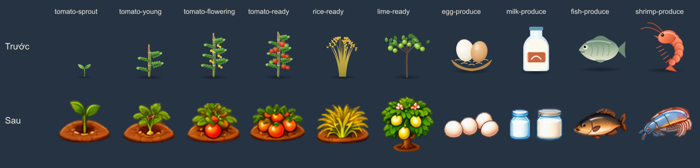
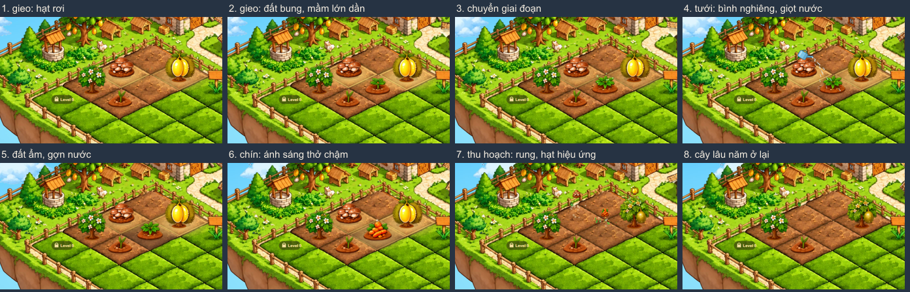
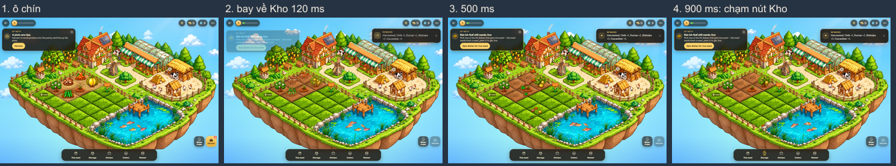
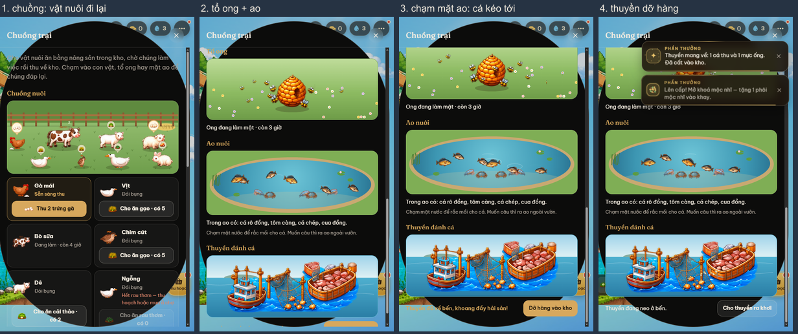

# Nâng cấp vật phẩm nông trại: bàn giao

Ngày: 2026-10-02. Nhánh `main`, các commit `801ded9` → `20801d9` (+ commit kèm tài liệu này).
Chưa deploy production.

Bảng chi tiết từng vật phẩm, nguồn sản xuất, trạng thái và hình được **sinh tự động** từ code:
[vat-pham-nong-trai-bang.md](vat-pham-nong-trai-bang.md)
(`FARM_REPORT=1 node scripts/run-vitest.mjs run src/data/farmItems.report`).

## Kết quả, nói thẳng

| | Số lượng |
|---|---|
| Nguyên liệu thô hợp lệ | **67**: 14 có sẵn (thay hình) + 53 mới |
| Nguồn sản xuất | 46 loại cây trong ô (26 rau, 15 cây lâu năm, 5 nấm), 8 vật nuôi, 1 trại ong, 1 ao, 1 thuyền |
| Hình đã xuất | 272 tệp trong `public/images/farm-items/` |
| Mức chắc chắn khi nhận dạng (75 mục: vật phẩm + vật nuôi) | 47 "high", 27 "medium", 1 "low" (cá nục) |
| Món chế biến mới | 0 (ảnh nguồn không có) |

Mục tiêu ~150 nguyên liệu **chưa đạt**. Ảnh nguồn chỉ có khoảng 70 đối tượng nhận dạng được.
Phần còn lại là giai đoạn phát triển, hình lặp lại (khoảng 18 con cá chỉ khác màu) hoặc hình chưa nhận dạng.
Không có nguyên liệu nào được thêm chỉ để đủ số.

## 1. Nguồn hình và kiểm duyệt

- `storage/item-pdf-v2-check/sprites/` (249 vùng cắt tự động) **không dùng**. Nhiều vùng dính 2–5 hình theo cột.
- `scripts/farm-items/cut.mjs` cắt lại từ `source.png` theo **lưới thật** của từng khối (`grid.json`):
  - Ranh giới giữa hai ô là dòng thưa nhất giữa chúng (eo hẹp nhất), nên viền được giữ đủ.
  - Chỉ giữ phần hình thuộc ô đó; mảnh thừa của ô bên cạnh bị bỏ.
  - Màu của điểm ảnh bán trong suốt được làm sạch. Ảnh nguồn còn màu đỏ dưới vùng trong suốt nên khi thu nhỏ bị quầng đỏ; giờ không còn.
  - Hình giữ đúng kích thước gốc, không phóng to.
- Bảng duyệt: `storage/farm-items-cut/review-*-{dark,light}.png`, mỗi khối có bản nền tối và bản nền sáng. Phần trắng của trứng, sữa, lông, hoa giữ đủ trên cả hai nền.
- `scripts/farm-items/catalog.json` là **bảng ánh xạ tập trung** giữa vật phẩm, giai đoạn và hình. Mỗi mục ghi mức chắc chắn khi nhận dạng loài, giai đoạn còn thiếu, và các hình đã bỏ vì chưa nhận dạng được.
- `src/data/sprites.ts` là nơi duy nhất mọi màn hình lấy đường dẫn hình.
- Ảnh nguồn không bị ghi đè. Toạ độ cắt của từng hình nằm trong `public/images/farm-items/rects.json`.
- Chạy lại toàn bộ: `npm run assets:farm-items`.

## 2. Thay hình ở mọi nơi

Mọi chỗ hiển thị đều đi qua `cropSprite`, `produceSprite` hoặc `animalSprite`:
- ô trồng trong nông trại 2D;
- thẻ ô trồng, khay hạt;
- Kho, Chợ (bán, mua hạt);
- đơn của Cô Ba, bếp (nguyên liệu công thức), nhiệm vụ và phần thưởng;
- tặng hạt cho bạn;
- đảo 3D khi ghé vườn bạn (hình 2D quay về phía camera, cả 46 loại cây);
- trang showcase.

Hình cây trồng và nông sản cũ trong `public/images/garden/` đã bị xoá; chỉ còn 4 hình đồ trang trí.

## 3. Danh mục và luật chơi (`src/data/game.ts`, `src/domain/`)

- **Rau, ngũ cốc, gia vị:** trồng một lần, thu một lần, ô trống lại.
- **Cây lâu năm** (15 loại, gồm chanh trước đây là rau):
  - Lần đầu ra trái sau 2 + 1,5 × cấp (giờ); các lần sau bằng 60% thời gian đó.
  - Sau thu hoạch cây **ở lại** và quay về giai đoạn ra hoa.
  - Có nút "Nhổ cây" để giải phóng ô.
- **Nấm:** đặt phôi vào ô, thu 3 đợt cách nhau 3 giờ, rồi phôi hết.
- **Vật nuôi:** gà, vịt, bò, chim cút, dê, ngỗng, cừu, thỏ. Cho ăn một loại cây đã mở trước đó, chờ, rồi nhận trứng, sữa hoặc lông.
- **Trại ong:** tự đầy sau 8 giờ, cho mật ong và bánh sáp, rồi tự bắt đầu lại.
- **Ao:** câu được cá rô đồng và tôm như cũ; cá chép mở ở cấp 3, cua ở cấp 5.
- **Thuyền đánh cá** (mở ở cấp 5): đi 4 giờ, mang về 2 loại hải sản tuỳ cấp.
- **Mở khoá dần theo cấp**, từ cấp 2 đến cấp 14. Lúc đầu chỉ có 6 cây cơ bản như trước.
- **Cân bằng theo công thức** (ghi chú ngay trong code):
  - Rau: giá hạt = 3 × giá bán, vì mỗi ô cho 3 phần.
  - Cây lâu năm hoàn vốn trong vòng 10 lần thu.
  - 10 cây cũ giữ nguyên chỉ số.
- **Đơn của Cô Ba** lấy từ mọi nguyên liệu người chơi đã làm ra được.
- **Kho và Chợ** có ô tìm kiếm (gõ không dấu vẫn ra) và nút lọc theo nhóm khi danh sách dài. Chợ ghi rõ mỗi loại hạt mọc ra sao và hiện các cây sắp mở.

### Dữ liệu lưu
- Phiên bản 2, có bước chuyển đổi từ phiên bản 1. Kho, tiền, hạt, cây đang trồng, vật nuôi, nhiệm vụ và bạn bè đều giữ nguyên; vật phẩm mới bắt đầu từ 0.
- Bản lưu cũ ở cấp cao được mở khoá đúng cấp ngay khi tải (`SYNC_UNLOCKS`), mỗi phần quà chỉ nhận một lần.
- Bản lưu từ phiên bản mới hơn không đọc được thì được cất riêng, không bị ghi đè.

### Hiệu ứng không quyết định luật chơi
- Mọi phần thưởng đi qua sổ cái chống trả trùng. Bấm lặp nhanh, bật giảm chuyển động hay tạm dừng trang đều không làm sai sản lượng hoặc tiền.
- Hiệu ứng chỉ chạy **sau** khi dữ liệu đã cập nhật.

## 4. Animation đang hoạt động

Mọi chuyển động đều làm bằng biến đổi hình, đường đi và hạt hiệu ứng trên hình tĩnh.
**Không có** animation theo khung hình hay chuyển động chân/cánh thật, vì ảnh nguồn chỉ có một khung, và không có bộ phận nào bị cắt rời.

**Ô trồng** (`src/features/farm-anim/`, một vòng lặp chung):
- Lá rau đung đưa theo gió, mỗi ô lệch pha nhau. Cây ăn trái đung đưa chậm và ít hơn, xoay quanh gốc. Nấm đứng yên.
- Gieo: hạt rơi xuống, đất bung lên, mầm lớn dần.
- Chuyển giai đoạn: hình mới lớn dần và hoà dần vào hình cũ, không bật đột ngột.
- Tưới: bình nghiêng, dòng giọt nước, gợn trên đất, đất sẫm màu dần.
- Chín: ánh sáng và viền vàng "thở" chậm, không nhấp nháy.
- Thu hoạch:
  - Cây rung nhẹ, hạt hiệu ứng theo loại: lá, lá rụng từ tán cây, bào tử nấm.
  - Nông sản **bay về nút Kho**; vị trí tính lúc bắt đầu bay, nên vẫn đúng khi kéo camera, phóng to hay đổi cỡ màn hình.
  - Cây lâu năm ở lại.

**Chuồng trại** (`src/features/ranch/`, một vòng lặp cho mỗi bảng đang mở):
- Vật nuôi thở theo nhịp riêng, quay đầu, đi lại trong rào mà không đè lên nhau.
- Phản hồi khi chạm, cho ăn hoặc thu sản phẩm; bong bóng sản phẩm nổi nhẹ khi đã sẵn sàng.
- Ong bay vòng cong quanh tổ, có giới hạn số lượng (2 / 4 / 7 theo mức chất lượng). Tổ đầy thì sáng nhẹ; thu mật thì ong toả ra.
- Ao:
  - Cá bơi mềm và đổi hướng mượt trong vùng nước.
  - Tôm giật lùi từng đoạn ngắn, cua bò ngang — không dùng kiểu bơi của cá.
  - Có bong bóng và gợn nước; chạm mặt nước là cá kéo tới.
- Thuyền dập dềnh ở bến, ra khơi rồi quay về.

**Đảo 3D:** cây quay về phía camera, đung đưa quanh gốc. Toàn đảo chỉ dùng một hàm cập nhật mỗi khung hình.

**Hiệu năng:**
- Bể hạt hiệu ứng cố định và tái sử dụng: ô trồng tối đa 40 / 120 / 240, chuồng trại 24 / 60 / 120 tuỳ mức chất lượng.
- Tạm dừng khi tab ẩn hoặc khi cảnh ra khỏi màn hình; dọn tài nguyên khi đóng bảng.
- Không cập nhật state React mỗi khung hình.
- Cài đặt chất lượng hiệu ứng (Tự động / Thấp / Vừa / Cao) nằm trong Hồ sơ.
- Khi giảm chuyển động: không có chuyển động hay hạt hiệu ứng, chỉ hoà hình ngắn; mọi chức năng vẫn chạy.

(Vòng tròn che một phần ảnh chuồng trại là lỗi của trình duyệt headless khi chuyển trang, không xuất hiện trong trình duyệt thật.)

## 5. Kiểm thử và hiệu năng

- `npm run verify` qua hết: định dạng, lint, biên dịch, 252 test (+1 bỏ qua: test sinh bảng), kiểm tra không animation SVG, build.
- Test mới:
  - `src/domain/farmItems.test.ts` (13 test): cây lâu năm, nấm, dọn ô, trại ong, thuyền, ao theo cấp, chuyển đổi bản lưu v1, mở khoá khi tải, cân bằng.
  - `src/features/ranch/ranch.test.ts` (12 test).
  - `selftest-friends.php` vẫn qua.
- Chơi thật trên angi.local (Chrome headless, 390×844), qua 8/8 bước:
  - Bản lưu v1 cấp 10 được chuyển đổi, giữ nguyên tiền, hạt, kho và ô đang trồng.
  - Gõ "xoai" tìm ra đúng cây xoài.
  - Bấm mua 3 lần nhanh: trừ đúng 3 × 60 xu.
  - Bán trứng; cho vật nuôi ăn; trại ong bắt đầu; thuyền ra khơi.
  - Tải lại trang: mọi thứ còn nguyên. Không có tệp nào lỗi tải.
- Chuồng trại: bấm đúp "thu" và "dỡ hàng" chỉ nhận thưởng một lần.

| Cảnh (Chrome headless, GPU thật) | Mức | fps | ms/khung |
|---|---|---|---|
| Ô trồng, trang showcase 1280×860 | cao / thấp | 60 | 2,1–2,5 |
| Ô trồng, trang showcase 390×844 | cao / thấp | 60 | ~2,0 |
| /journey sau thu hoạch 1280×860 / 390×844 | — | 60 | 2,1–3,0 |
| Chuồng trại 1280×860 | cao / thấp | 60 | ~0,21 (riêng engine) |
| Chuồng trại 390×844 | vừa | 60 | ~0,19 |

Chưa đo trên điện thoại thật.

## 6. Hình cần tạo thêm hoặc tạo lại

Danh sách đầy đủ, sinh từ `catalog.json`, nằm cuối [bảng](vat-pham-nong-trai-bang.md#hình-chưa-có-cần-tạo-thêm-hoặc-tạo-lại). Tóm tắt:
1. **Hình nông sản riêng** (không có đất hay cây) cho các loại rau và cây ăn trái đang tạm dùng hình giai đoạn chín. Hiện chỉ cà rốt, khoai lang, khoai môn có hình nông sản riêng.
2. **Giai đoạn còn thiếu:** cây non, ra hoa và chín-trong-đất cho cà rốt, khoai lang, khoai môn; giai đoạn mầm cho 7 cây ăn trái của khối B.
3. **Tổ ong không có ong vẽ dính** (3 giai đoạn), và một con ong nét hơn (bản hiện có khoảng 20 px).
4. **Sản phẩm của lợn**, nếu muốn lợn thành nguồn sản xuất. Hiện có hình lợn nhưng không có sản phẩm.
5. **Hình món chế biến**, nếu muốn có cơ sở chế biến.
6. **Khung hình chuyển động hoặc hình tách lớp** (đầu, thân, chân, cánh) cho vật nuôi, ong và cá, nếu muốn chuyển động khớp thật.
7. **Bản vẽ độ phân giải cao hơn:** mỗi vật phẩm hiện chỉ khoảng 60–120 px.
8. **Xác nhận lại loài** cho các hình mức "medium" hoặc "low" (xem cột Nhận dạng trong bảng), và các hình chưa nhận dạng (bắp cải thứ hai, củ tròn màu cam, cỏ xanh, củ nhạt màu, cây trái đỏ, nấm nâu thứ hai, vỏ sò hoa văn…).

## 7. Giới hạn còn lại

- Nhiều loại rau và cây ăn trái hiện ở Kho và Chợ bằng hình cây trên đất (mục 6.1).
- Bạn bè ghé vườn chỉ thấy gà và bò trên đảo 3D. Các vật nuôi khác chỉ có trong bảng Chuồng trại của chính người chơi.
- Nhổ một phôi nấm đang chín ở đợt cuối sẽ chạy hiệu ứng như thu hoạch.
- Nếu kéo camera trong 0,8 giây lúc nông sản đang bay, điểm xuất phát không đổi theo.
- Server (`Friends.php`) giữ một danh sách mã cây để kiểm tra hạt được tặng; khi thêm cây mới phải thêm vào cả hai nơi.

## Tệp chính

- **Hình:** `scripts/farm-items/{cut.mjs, grid.json, catalog.json}`, `public/images/farm-items/`, `src/data/sprites.ts`.
- **Dữ liệu và luật chơi:** `src/data/{types.ts, game.ts}`, `src/domain/{selectors.ts, reducer.ts, progress.ts, persistence.ts, orders.ts}`, `src/domain/farmItems.test.ts`.
- **Giao diện:**
  - Kho, Chợ: `src/features/food-reel/journey/{ItemFilter.tsx, filterItems.ts, StoragePanel.tsx, MarketSection.tsx}`.
  - Nông trại: `FarmGame.tsx`, `FarmPlotCard.tsx`, `JourneyScene.tsx`.
  - Hồ sơ: `src/components/profile/ProfileSheet.tsx`.
- **Animation:** `src/features/farm-anim/` (ô trồng), `src/features/ranch/` (chuồng trại), `src/features/garden3d/scene/{Crop.tsx, Plots.tsx}` (đảo 3D).
- **Chữ (vi + en):** `src/i18n/messages/{vi,en}/{data,journey,farm,ranch,account}.ts`.
- **Server:** `server/lib/Friends.php`; `server/bin/selftest-friends.php` không đổi.
